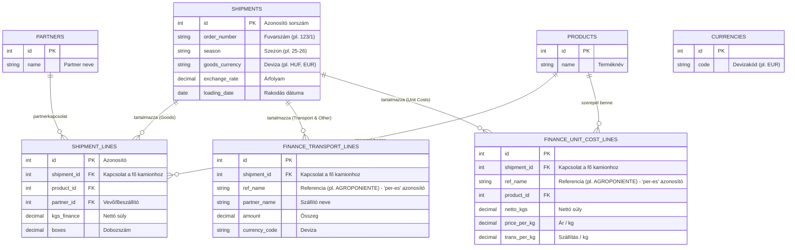

# GAVA ERP - Adatbázis ER Diagram (2026-07-13)
A jelenlegi állapot szerinti főbb pénzügyi és kamion adatbázis kapcsolatok (Különös tekintettel a "per-es" fuvarok és a kiegészítő pénzügyi táblák működésére).

## Kapcsolatok magyarázata
A `SHIPMENTS` tábla (Kamionok) a fő elem, amely a szezonnal és fuvarszámmal együtt képzi a logikai egyediséget. Az adatbázisban a gépi `id` (PK) kapcsolja össze a táblákat.
A pénzügyi táblák (`FINANCE_TRANSPORT_LINES` és `FINANCE_UNIT_COST_LINES`) a `shipment_id` mellett tartalmaznak egy `ref_name` oszlopot is. Ennek segítségével a rendszer az egy kamionhoz tartozó, de több részre bontott (pl. "AGROPONIENTE" és "AGROPONIENTE NATURAL") pénzügyi elszámolásokat egyértelműen szét tudja választani a "per-es" fuvarok esetén.
