# Gava Hungria ERP – Relációs Adatbázis és Backend Terv

A jelenlegi MS Access + Excel alapú ERP rendszert egy modern, szerverre telepíthető relációs adatbázisra és REST API-ra cseréljük le. Ez a terv a teljes architekturális döntéseket, az adatbázis sémát és a bevezetési lépéseket tartalmazza.

---

## User Review Required

> [!IMPORTANT]
> A terv több helyen tartalmaz döntési pontokat. Kérlek nézd végig és jelezd, ha bármit módosítanál, mielőtt belekezdünk a megvalósításba.

---

## Open Questions

> [!IMPORTANT]
> **1. Szerver hozzáférés:** A `192.168.1.5` szerveren milyen operációs rendszer fut (Windows Server / Linux)? Van-e rajta Docker, vagy telepíthetünk rá?

> [!IMPORTANT]
> **2. Felhasználókezelés:** Jelenleg a bejelentkezés `Environ$("COMPUTERNAME")` alapú. Az új rendszerben is ez marad, vagy felhasználónév + jelszó alapú autentikáció legyen (mint a mostani webes felületen)?

> [!IMPORTANT]
> **3. Meglévő adatmennyiség:** Körülbelül hány rekord van jelenleg az egyes Excel/Access táblákban? Ez segít a migrációs stratégia megtervezésében.

> [!IMPORTANT]
> **4. n8n / gavaapi.live integráció:** A `basWebhooks` modul jelenleg webhook-okat küld a `gavaapi.live`-ra. Ez az n8n rendszer továbbra is marad? Ha igen, a backend integrálódik vele.

> [!IMPORTANT]
> **5. A `gavaapi.live` domain:** A Gava szerverének van-e nyilvános domain neve (pl. `gavaapi.live`), vagy a webalkalmazás csak helyi hálózaton (LAN / VPN) lesz elérhető?

---

## 1. Javasolt Technológiai Stack

### Backend keretrendszer: **Node.js + Express.js**

| Szempont | Indoklás |
|---|---|
| **Közös nyelv a frontendel** | A meglévő Access UI már JavaScript-ben íródott – egyetlen nyelv a teljes stackre |
| **Könnyű telepíthetőség** | Nem kell Java/Python runtime; egy `node` bináris és `npm install` elegendő |
| **REST API** | Express.js az iparági standard könnyű API keretrendszer |
| **Karbantarthatóság** | Széles körben ismert, hatalmas közösség, egyszerű debug |

### Adatbázis: **PostgreSQL**

| Szempont | Indoklás |
|---|---|
| **Ingyenes, nyílt forráskódú** | Nincs licencköltség, szemben az MS SQL Server-rel |
| **Reláció-központú** | Natív JOIN-ok, idegenkulcsok, triggerek – pont ami az Access logikát helyettesíti |
| **JSON támogatás** | Ha a jövőben rugalmas mezőkre lesz szükség (pl. egyedi megjegyzések) |
| **Szerver-barát** | Windowson és Linuxon egyaránt fut; Docker-ben is pillanatok alatt telepíthető |
| **Kalkulált mezők** | A Transport Cost V2 logika SQL-ben is leírható `VIEW`-ként |

### ORM / Query Builder: **Knex.js**

- Tiszta SQL-szerű szintaxis, nem kell új ORM nyelvet tanulni
- Beépített migráció-kezelés (séma verziózás)
- PostgreSQL natív támogatás

### Fájltárolás

A jelenlegi `.xlsm`, `.docx` fájlok **továbbra is a szerveren maradnak** (a `\\192.168.1.5\raktar\...` útvonalon). Az adatbázisban csak az **elérési utat** tároljuk (`file_path` mező).

---

## 2. Teljes Relációs Séma

### ER-diagram (Mermaid)

```mermaid
erDiagram
    seasons ||--o{ shipments : "tartalmaz"
    seasons ||--o{ transport_orders : "tartalmaz"
    seasons ||--o{ ekaer_records : "tartalmaz"
    transporters ||--o{ shipments : "szállít"
    transporters ||--o{ transport_orders : "rendel"
    transporters ||--o{ ekaer_records : "végzi"
    shipments ||--o{ shipment_lines : "tételek"
    shipments ||--o{ loading_events : "rakodás"
    products ||--o{ shipment_lines : "termék"
    products ||--o{ product_demands : "igény"
    partners ||--o{ shipment_lines : "vevő"
    partners ||--o{ product_demands : "partner"
    loading_events ||--o{ product_demands : "hozzárendelve"

    seasons {
        int id PK
        string code "pl. 25-26"
        date start_date
        date end_date
    }

    transporters {
        int id PK
        string name "pl. KÓNYA"
        string code "rövid kód"
        bool is_active
    }

    shipments {
        int id PK
        string order_number UK "GHU 240, LOG149, H269, BEL015"
        string truck_type "BEL, EX, GHU, H, LOG"
        int truck_seq_number "sorszám"
        int season_id FK
        int transporter_id FK
        string plate_number
        string loading_place
        date loading_date
        date unloading_date
        date arrival_date
        decimal transport_price
        string transport_currency "EUR, HUF"
        decimal invoice_amount_eur
        decimal invoice_amount_huf
        string invoice_number
        date payment_date
        string comment
        string file_path "xlsm elérés"
        bool is_receipted "bevételezve"
        decimal kb
        decimal b
        decimal t
    }

    shipment_lines {
        int id PK
        int shipment_id FK
        int product_id FK
        int partner_id FK
        string customer "GHU, FRUBALMED"
        string destination "ALDI, SPAR HU ÜLLŐ"
        int euro_palets
        int normal_palets
        decimal total_palets "számított"
        decimal gross_weight_kg
        decimal price_eur
        decimal price_bcn_eur
        string unit
        decimal reloading_per_plt
        decimal transport_bcn_per_plt
        string albaran_number
        decimal transport_cost "számított"
        decimal transport_cost_product "számított"
        string comment
    }

    loading_events {
        int id PK
        int shipment_id FK
        date loading_date
        string loading_place
        bool is_loaded "Rakodva checkbox"
        datetime loaded_at "webhook trigger idő"
        int created_by FK
    }

    transport_orders {
        int id PK
        int shipment_id FK
        int season_id FK
        int transporter_id FK
        string document_name "KONYA TRANS GHU 240.DOCX"
        string file_path
        date loading_date
        bool is_sent "Kiküldve"
        datetime created_at
    }

    ekaer_records {
        int id PK
        int shipment_id FK
        int season_id FK
        int transporter_id FK
        string ekaer_file_name
        string file_path
        date load_date
        bool is_sent "Kiküldve"
        datetime created_at
    }

    products {
        int id PK
        string name "PEACH 7KG, NECTARIN 10*1KG"
        string category
        string reference "VERMION FRESH, FRUBALMED"
        bool is_active
    }

    partners {
        int id PK
        string name "ALDI, SPAR"
        string type "vevő, szállító, felrakó"
        string address
        string contact
        bool is_active
    }

    product_demands {
        int id PK
        int loading_event_id FK
        int product_id FK
        int partner_id FK
        string customer_name "vevő"
        int pallet_count "raklap szám"
        bool is_sent_to_truck "Küldés kamionra"
        datetime sent_at
    }

    users {
        int id PK
        string username
        string password_hash
        string full_name
        string role "Admin, Iroda1, Iroda2, Iroda3"
        string computer_name "régi kompatibilitás"
        bool is_active
        datetime last_login
    }

    pallet_conversion {
        int normal_count PK
        int euro_equivalent
    }
```



---

## 3. Access/Excel → PostgreSQL Megfeleltetés

### Jelenlegi struktúra → Új tábla leképezés

| Jelenlegi forrás | Jelenlegi mező | Új tábla | Új mező |
|---|---|---|---|
| **Excel: Transportistas (Sheet1)** | Loading date (A oszlop) | `shipments` | `loading_date` |
| | Order number (C oszlop) | `shipments` | `order_number` |
| | Transport price / T (K oszlop) | `shipments` | `transport_price` |
| | Transporter | `transporters` → `shipments.transporter_id` | FK reláció |
| | Plate number | `shipments` | `plate_number` |
| **Excel: Fuvarok összesítő** | N° Euro Palets | `shipment_lines` | `euro_palets` |
| | N° Normal Palets | `shipment_lines` | `normal_palets` |
| | Total Palets | `shipment_lines` | `total_palets` (számított) |
| | Products | `products` → `shipment_lines.product_id` | FK reláció |
| | Transport cost | `shipment_lines` | `transport_cost` (számított) |
| | Transport Cost / product | `shipment_lines` | `transport_cost_product` (számított) |
| **Access: Form_Rakodás** | Kamionszám | `shipments` | `order_number` |
| | Rakodás nap | `loading_events` | `loading_date` |
| | Fuvarozó | `transporters` → `shipments.transporter_id` | FK reláció |
| | Rakodva (checkbox/trigger) | `loading_events` | `is_loaded` + webhook |
| **Access: Form_Fuvarmegbízás** | Dokumentum név | `transport_orders` | `document_name` |
| | FilePath | `transport_orders` | `file_path` |
| | Kiküldve | `transport_orders` | `is_sent` |
| **Access: Form_EKAEREK** | EKAER_FileName | `ekaer_records` | `ekaer_file_name` |
| | Load_Date | `ekaer_records` | `load_date` |
| | Kiküldve | `ekaer_records` | `is_sent` |
| **Access: Áru igény** | Raklap | `product_demands` | `pallet_count` |
| | Termék | `products` → FK | `product_id` |
| | Partner / Vevő | `partners` → FK | `partner_id` + `customer_name` |
| | Küldés kamionra | `product_demands` | `is_sent_to_truck` |

---

## 4. Egyedi Kulcs (Composite Key) Definíció

> [!IMPORTANT]
> **Elsődleges azonosítás:** Minden rekordot egy **`order_number` + `season_id`** pár azonosít egyértelműen. Ez a `shipments` tábla `UNIQUE` constraint-je.

```sql
-- A shipments táblában:
ALTER TABLE shipments
  ADD CONSTRAINT uq_shipment_order_season
  UNIQUE (order_number, season_id);
```

Ez biztosítja, hogy:
- `GHU 240` a `25-26`-os szezonban egyedi
- Ugyanaz az `order_number` létezhet más szezonban (pl. ha ciklikusan újrahasználják a számokat)

---

## 5. Transport Cost V2 – Adatbázis VIEW

A jelenlegi VBA logika (`KalkulaldOsszPalettat`, `CalcTransportCost`) SQL VIEW-ként:

```sql
CREATE VIEW v_shipment_costs AS
WITH shipment_totals AS (
    SELECT
        sl.shipment_id,
        SUM(sl.euro_palets) AS sum_euro,
        SUM(sl.normal_palets) AS sum_normal,
        -- Egyszeri átváltás a váltótáblából
        COALESCE(pc.euro_equivalent, 0) AS converted_normal_to_euro
    FROM shipment_lines sl
    LEFT JOIN pallet_conversion pc ON pc.normal_count = (
        SELECT SUM(sl2.normal_palets) FROM shipment_lines sl2 WHERE sl2.shipment_id = sl.shipment_id
    )
    GROUP BY sl.shipment_id, pc.euro_equivalent
),
shipment_grand AS (
    SELECT
        shipment_id,
        sum_euro,
        sum_normal,
        converted_normal_to_euro,
        (sum_euro + converted_normal_to_euro) AS grand_total_palets
    FROM shipment_totals
)
SELECT
    sl.id AS line_id,
    sl.shipment_id,
    s.order_number,
    -- Soronkénti Total Palets
    CASE
        WHEN sg.sum_normal = 0 THEN sl.euro_palets
        ELSE sl.euro_palets + (sg.converted_normal_to_euro * (sl.normal_palets::decimal / NULLIF(sg.sum_normal, 0)))
    END AS calculated_total_palets,
    -- Transport Cost per sor
    CASE
        WHEN sg.grand_total_palets = 0 THEN 0
        ELSE s.transport_price * (
            CASE
                WHEN sg.sum_normal = 0 THEN sl.euro_palets
                ELSE sl.euro_palets + (sg.converted_normal_to_euro * (sl.normal_palets::decimal / NULLIF(sg.sum_normal, 0)))
            END / sg.grand_total_palets
        )
    END AS calculated_transport_cost
FROM shipment_lines sl
JOIN shipments s ON s.id = sl.shipment_id
JOIN shipment_grand sg ON sg.shipment_id = sl.shipment_id;
```

---

## 6. API Endpoint Struktúra

A webes frontend (Access UI) ezeken az endpoint-okon keresztül kommunikál a backend-del:

```
BASE URL: http://<szerver-ip>:3000/api/v1
```

### Shipments (Fuvarok)
| Metódus | Útvonal | Leírás |
|---|---|---|
| `GET` | `/shipments` | Összes fuvar (szűrőkkel: `?season=25-26&transporter=KÓNYA`) |
| `GET` | `/shipments/:id` | Egy fuvar részletei tételsokkal |
| `POST` | `/shipments` | Új kamion létrehozása (Rakodás: „Új kamion" modal) |
| `PUT` | `/shipments/:id` | Fuvar módosítása (kamionszám szerkesztés) |
| `DELETE` | `/shipments/:id` | Fuvar törlése |

### Shipment Lines (Fuvar tételsorok)
| Metódus | Útvonal | Leírás |
|---|---|---|
| `GET` | `/shipments/:id/lines` | Tételsorok egy fuvarhoz (Fuvarok összesítő) |
| `POST` | `/shipments/:id/lines` | Új tételsor hozzáadása |
| `PUT` | `/shipment-lines/:lineId` | Tételsor módosítása |

### Transport Orders (Fuvarmegbízások)
| Metódus | Útvonal | Leírás |
|---|---|---|
| `GET` | `/transport-orders` | Lista szűrőkkel (`?season=25-26&kamion=GHU`) |
| `POST` | `/transport-orders` | Új megbízás |
| `DELETE` | `/transport-orders/:id` | Megbízás törlése (megerősítéssel) |
| `PUT` | `/transport-orders/:id/send` | Kiküldve jelölés |

### EKAER
| Metódus | Útvonal | Leírás |
|---|---|---|
| `GET` | `/ekaer` | Lista szűrőkkel |
| `POST` | `/ekaer` | Új EKAER rekord |
| `DELETE` | `/ekaer/:id` | EKAER törlése |

### Loading / Rakodás
| Metódus | Útvonal | Leírás |
|---|---|---|
| `GET` | `/loading-events` | Rakodások listája |
| `POST` | `/loading-events` | Új rakodás rögzítése |
| `PUT` | `/loading-events/:id/loaded` | **Rakodva trigger** – webhook küldés |

### Product Demands (Áru igény)
| Metódus | Útvonal | Leírás |
|---|---|---|
| `GET` | `/product-demands` | Áru igények listája |
| `PUT` | `/product-demands/:id/send` | Küldés kamionra (piros→zöld gomb) |

### Referencia adatok
| Metódus | Útvonal | Leírás |
|---|---|---|
| `GET` | `/seasons` | Szezonok listája |
| `GET` | `/transporters` | Fuvarozók listája (szezonfüggő szűréssel) |
| `GET` | `/products` | Termékek listája |
| `GET` | `/partners` | Partnerek listája |
| `GET` | `/pallet-conversion` | Raklap váltótábla |

### Autentikáció
| Metódus | Útvonal | Leírás |
|---|---|---|
| `POST` | `/auth/login` | Bejelentkezés (JWT token) |
| `GET` | `/auth/me` | Jelenlegi felhasználó adatai |

---

## 7. Projekt Mappastruktúra

```
Access UI/
├── index.html              ← meglévő frontend
├── src/                    ← meglévő JS modulok
│
└── server/                 ← ÚJ: Backend
    ├── package.json
    ├── knexfile.js          ← Adatbázis konfiguráció
    ├── .env                 ← Titkos változók (DB_HOST, DB_PASS stb.)
    ├── server.js            ← Express belépési pont
    ├── src/
    │   ├── routes/          ← API útvonalak
    │   │   ├── shipments.js
    │   │   ├── transport-orders.js
    │   │   ├── ekaer.js
    │   │   ├── loading.js
    │   │   ├── auth.js
    │   │   └── ...
    │   ├── middleware/       ← Auth, hibakezelés
    │   │   ├── auth.js
    │   │   └── errorHandler.js
    │   ├── services/        ← Üzleti logika (Transport Cost V2 stb.)
    │   │   ├── costCalculator.js
    │   │   └── webhookService.js
    │   └── db/
    │       └── migrations/  ← Knex migrációk (séma verziók)
    │           ├── 001_create_seasons.js
    │           ├── 002_create_transporters.js
    │           ├── 003_create_shipments.js
    │           └── ...
    └── seeds/               ← Teszt adatok betöltése
        ├── 01_seasons.js
        ├── 02_pallet_conversion.js
        └── ...
```

---

## 8. Telepítés a Digital Ocean Szerverre (Droplet - 138.68.143.223)

A meglévő N8N és Flowise alkalmazások mellé az ERP-t egy szeparált Docker Compose környezetként telepítjük a Droplet-re. Ez biztosítja, hogy ne zavarja a többi szolgáltatást, és a `gavaapi.online` domainen (pl. egy új porton vagy aldomainen) könnyen elérhető legyen.

### A telepítési csomag (Helyi gépen elkészítendő fájlok)

A következő fájlokat kell létrehoznunk a helyi gépen:

#### [NEW] [docker-compose.prod.yml](file:///C:/Users/klara/Documents/Nepelemes%20%C3%BCgyek/Gav%C3%A1/ERP%20Access/docker-compose.prod.yml)
A szerver infrastruktúra leírása (PostgreSQL adatbázis + Node.js API + Nginx webszerver a frontendnek).

#### [NEW] [server/Dockerfile](file:///C:/Users/klara/Documents/Nepelemes%20%C3%BCgyek/Gav%C3%A1/ERP%20Access/server/Dockerfile)
A Node.js backend konténerizálására szolgáló konfiguráció.

#### [NEW] [nginx.conf](file:///C:/Users/klara/Documents/Nepelemes%20%C3%BCgyek/Gav%C3%A1/ERP%20Access/nginx.conf)
A webszerver beállítása, amely kiszolgálja az `Access UI` fájlokat, és az API kéréseket (`/api/v1`) továbbítja a Node.js backend felé.

### Telepítés menete (A felhasználó feladatai)

1. **Fájlok felmásolása (SCP)**
   Miután a fájlok elkészültek, a helyi gépről a Windows parancssorból egyetlen paranccsal felmásoljuk a teljes `ERP Access` mappát a Digital Ocean szerverre:
   `scp -r "C:\Users\klara\Documents\Nepelemes ügyek\Gavá\ERP Access" root@138.68.143.223:/root/gava_erp`
   
2. **Indítás a DO Terminálból**
   A Digital Ocean weben elérhető termináljába belépve:
   ```bash
   cd /root/gava_erp
   docker-compose -f docker-compose.prod.yml up -d --build
   ```

3. **Adatbázis inicializálása**
   A futó Node.js konténerben lefuttatjuk a migrációkat:
   `docker exec -it gava_erp_api npm run migrate`

### User Review Required (Döntési pont)
> [!IMPORTANT]
> Szeretnéd, hogy létrehozzam ezt az előkészített `docker-compose.prod.yml` fájlt és a `Dockerfile`-okat, hogy utána egyetlen másolással telepíthető legyen a rendszer?

---

## 9. Migrációs Stratégia (Access/Excel → PostgreSQL)

### Fázis 1: Séma létrehozása
- Knex migrációk futtatása → üres táblák létrejönnek

### Fázis 2: Referencia adatok
- `seasons`: Manuális seed (19-20 ... 25-26)
- `transporters`: Manuális seed (KÓNYA, STI, BILEK, stb.)
- `pallet_conversion`: A [Raklap váltó.txt](file:///c:/Users/klara/Documents/Nepelemes%20ügyek/Gavá/ERP%20Access/Raklap%20váltó.txt) automatikus betöltése
- `products`, `partners`: Az Excel adatokból kinyert egyedi értékek

### Fázis 3: Tranzakciós adatok
- **Transportistas Excel → `shipments`**: CSV export → `COPY` parancs vagy Node.js script
- **Fuvarok összesítő Excel → `shipment_lines`**: Hasonlóan, a 29 oszlop leképezése
- **Access FileMapDatabase → `transport_orders` + `ekaer_records`**: Az Access táblák exportja CSV-be, majd importálás

### Fázis 4: Validáció
- Rekord számok egyeztetése
- Transport Cost V2 számítások összehasonlítása az Excel eredményeivel

---

## Verification Plan

### Automatizált tesztek
- `npm test` – API endpoint tesztek (Jest + Supertest)
- Transport Cost V2 kalkuláció unit tesztek a váltótáblával
- Migrációs integritás teszt (FOREIGN KEY-ek, UNIQUE constraint-ek)

### Manuális ellenőrzés
- A webes felületen (Access UI) mock adatok lecserélése API hívásokra
- Szűrők és keresések tesztelése valós adatokkal
- Transport Cost értékek összehasonlítása az Excel eredményeivel
